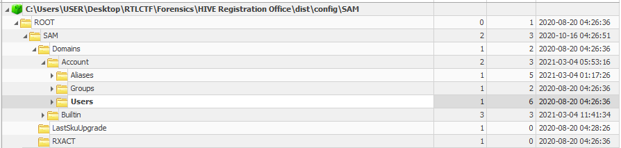
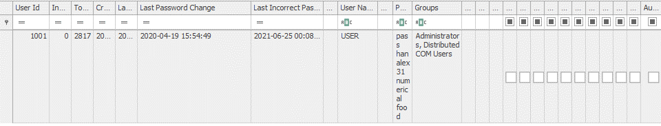
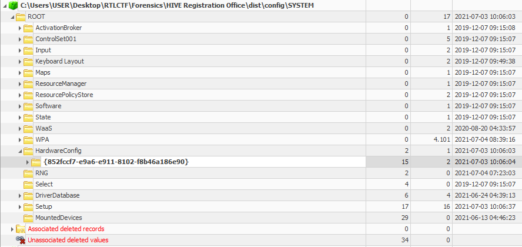
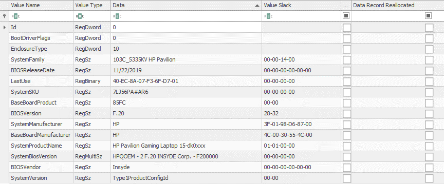
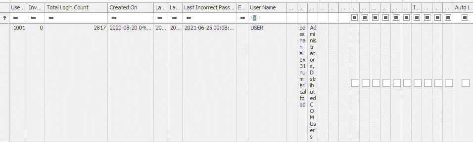

# Challenge Description

Given the scenario:

```
HIVE Registration Office is finally hiring a DFIR Candidate all over
the world. Here, they provided you some Windows Artifacts that may 
help you during the analysis.

This will be your first interview!
You should answer the following questions:

* When was the last time this person changed his/her password?
Format: `hh:mn:sc yyyy/mm/dd`

* What is the manufacturer's name of this USER's laptop?
i.e -> `McDonalds`
 
* What is the BIOS Vendor's Name?

* How many times does this user logon?


Flag's format is a combination of all the answers above:
i.e:
`RTL{10:12:13 1991/12/16_McDonalds_Amazon_1337}`

See you on the next interview!
```
# POC 

The objective of the challenge is to find the corresponding
information based on the task given and the Windows Artifacts.
The main artifacts that will be used here is the `Windows Hive` or
`Windows Registry`.

We can use Registry Explorer Tools or RegRipper which can be retrieved from
Eric Zimmerman's website. He offers a lot of forensic tools that may help us
in this activity. You may download them from this link:
https://ericzimmerman.github.io/#!index.md

After downloaded, you can pass all the registry to the tools.


**When was the last time this person changed his/her password?**
The first question is related to Windows Account Information and it's related to
Windows Security Account Manager (SAM Registry). It's located on the Account Folder
where the Users Information can be retrieved, in this case, USER.



It's in the `Last Password Change` column.



So we know that the last time USER changed his password is `15:54:49 2020/04/19`.

Moving on to the next two questions can be retrieved in the same registry.

**What is the manufacturer's name of this USER's laptop?**
<br>

**What is the BIOS Vendor's Name?**

We can go to the SYSTEM Registry.



The second question's answer shall be `HP`, as we know that this laptop is HP Pavilion.



The third one should be `Insyde`, as it's the BIOS Vendor.

Last question's information can be retrieved in SAM Registry again and it's still in the same folder.
USER has logged on for `2817` times.



Finally the flag should be:
`RTL{15:54:49 2020/04/19_HP_Insyde_2817}`

