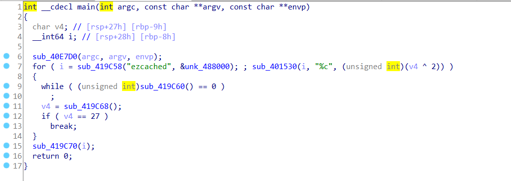

# Challenge Description

Given the scenario:
```
Aseng, a fresh-graduate who just lands his first job as an intern in
`Weeb Company` , has just been fooled by someone inside the
office. A day before the incident happened, he received a message from
his office's partner who turns out to be a fraud and surprisingly
that guy is from the **insiders**, the same work-faculty.
The fraud sent him a file from gofile.io and fooled him to run a fake 
Windows Service (Service Host Process).

Aseng was phished and social-engineered that the fraud successfully got
his password already from social-media. Unfortunately, the CCTV inside the
work office has been turned off since last week. Aseng was told to do 
some kind of memory dump of his office's laptop so that you, as an Office's
Incident Responders can investigate what kind of malicious activity does
the fraud do and what activity that triggers Aseng to send his password to
the fraud.

Link to access the file:

https://mega.nz/file/MYJ1BS5S

Decryption Key:
`GmXuj54yEHXxk6peslvJyH0m830A3ogdWkRPxhYHaOE`
```

You can download the challenge from the MEGA link. We are given a memory forensics challenge
where the objective of it should be investigation analysis. 
We can use `Volatility` tools which can be downloaded from this Github:
https://github.com/volatilityfoundation/volatility

I'd still strongly recommend to download Volatility 2 instead of Volatility 3 due to
its several plugins limitations.

# POC

We can use `imageinfo` or `kdbgscan` plugin in order to retrieve the OS Profile of the challenge.
The OS profile turns out to be Windows 7 SP1.

```
python vol.py -f /home/kali/Desktop/RTL-ASENG-PC-20210714-023616.raw kdbgscan
Volatility Foundation Volatility Framework 2.6.1
**************************************************
Instantiating KDBG using: /home/kali/Desktop/RTL-ASENG-PC-20210714-023616.raw WinXPSP2x86 (5.1.0 32bit)
Offset (P)                    : 0x2c47120
KDBG owner tag check          : True
Profile suggestion (KDBGHeader): Win7SP1x64
PsActiveProcessHead           : 0x2c80940
PsLoadedModuleList            : 0x2c9ec90
KernelBase                    : 0xfffff80002a64000

**************************************************
Instantiating KDBG using: /home/kali/Desktop/RTL-ASENG-PC-20210714-023616.raw WinXPSP2x86 (5.1.0 32bit)
Offset (P)                    : 0x2c47120
KDBG owner tag check          : True
Profile suggestion (KDBGHeader): Win7SP0x64
PsActiveProcessHead           : 0x2c80940
PsLoadedModuleList            : 0x2c9ec90
KernelBase                    : 0xfffff80002a64000

**************************************************
Instantiating KDBG using: /home/kali/Desktop/RTL-ASENG-PC-20210714-023616.raw WinXPSP2x86 (5.1.0 32bit)
Offset (P)                    : 0x2c47120
KDBG owner tag check          : True
Profile suggestion (KDBGHeader): Win2008R2SP1x64_24000
PsActiveProcessHead           : 0x2c80940
PsLoadedModuleList            : 0x2c9ec90
KernelBase                    : 0xfffff80002a64000

**************************************************
```

You can also refer to these Windows KDBG Magic Values.

| Operating System | KDBG Magic Values |
| ---------------- | ------------------|
| Windows XP | 00 00 00 00 00 00 00 00 4b 44 42 47 90 02 |
| Windows Server 2003 | 00 00 00 00 00 00 00 00 4b 44 42 47 18 03 |
| Windows Vista SP0 | 00 00 00 00 00 00 00 00 4b 44 42 47 28 03 |
| Windows Vista SP1 | 00 00 00 00 00 00 00 00 4b 44 42 47 30 03 |
| Windows Server 2008 | 00 00 00 00 00 00 00 00 4b 44 42 47 40 03 |
| Windows 7 | 00 00 00 00 00 00 00 00 4b 44 42 47 40 03 |


We can continue to list all the current process so we can minimize our investigation objectives.
`pslist` or `pstree` plugin shall do this.
```
python vol.py -f /home/kali/Desktop/RTL-ASENG-PC-20210714-023616.raw --profile=Win7SP1x64 pslist
Volatility Foundation Volatility Framework 2.6.1
Offset(V)          Name                    PID   PPID   Thds     Hnds   Sess  Wow64 Start                          Exit                          
------------------ -------------------- ------ ------ ------ -------- ------ ------ ------------------------------ ------------------------------
0xfffffa8018db6040 System                    4      0    114      613 ------      0 2021-07-14 02:27:00 UTC+0000                                 
0xfffffa80195512d0 smss.exe                248      4      2       29 ------      0 2021-07-14 02:27:00 UTC+0000                                 
0xfffffa801a146b00 csrss.exe               336    328     11      567      0      0 2021-07-14 02:27:07 UTC+0000                                 
0xfffffa801a170b00 csrss.exe               388    380     11      404      1      0 2021-07-14 02:27:08 UTC+0000                                 
0xfffffa801a177b00 wininit.exe             396    328      3       78      0      0 2021-07-14 02:27:08 UTC+0000                                 
0xfffffa801a18db00 winlogon.exe            432    380      5      117      1      0 2021-07-14 02:27:08 UTC+0000                                 
0xfffffa801a1eeb00 services.exe            492    396      9      225      0      0 2021-07-14 02:27:09 UTC+0000                                 
0xfffffa801a203b00 lsass.exe               500    396      7      752      0      0 2021-07-14 02:27:10 UTC+0000                                 
0xfffffa801a209b00 lsm.exe                 508    396     11      206      0      0 2021-07-14 02:27:10 UTC+0000                                 
0xfffffa801a3c1060 svchost.exe             600    492     10      359      0      0 2021-07-14 02:27:12 UTC+0000                                 
0xfffffa801a5b1b00 svchost.exe             680    492      8      294      0      0 2021-07-14 02:27:13 UTC+0000                                 
0xfffffa801a60d3f0 svchost.exe             768    492     23      583      0      0 2021-07-14 02:27:13 UTC+0000                                 
0xfffffa801a628500 svchost.exe             812    492     24      452      0      0 2021-07-14 02:27:14 UTC+0000                                 
0xfffffa801a62f930 svchost.exe             840    492     27      769      0      0 2021-07-14 02:27:14 UTC+0000                                 
0xfffffa801a638220 svchost.exe             864    492     48     1275      0      0 2021-07-14 02:27:14 UTC+0000                                 
0xfffffa801a657b00 audiodg.exe             936    768      5      128      0      0 2021-07-14 02:27:14 UTC+0000                                 
0xfffffa801a6c1b00 svchost.exe             384    492     27      684      0      0 2021-07-14 02:27:16 UTC+0000                                 
0xfffffa8019994060 spoolsv.exe            1084    492     15      277      0      0 2021-07-14 02:27:18 UTC+0000                                 
0xfffffa801a14d060 svchost.exe            1132    492     20      318      0      0 2021-07-14 02:27:19 UTC+0000                                 
0xfffffa80198f7060 svchost.exe            1252    492     10      146      0      0 2021-07-14 02:27:20 UTC+0000                                 
0xfffffa801991c060 svchost.exe            1280    492     26      257      0      0 2021-07-14 02:27:20 UTC+0000                                 
0xfffffa801a1c0060 VGAuthService.         1340    492      4       94      0      0 2021-07-14 02:27:21 UTC+0000                                 
0xfffffa801a7fd060 vmtoolsd.exe           1548    492     11      287      0      0 2021-07-14 02:27:25 UTC+0000                                 
0xfffffa801a88f350 svchost.exe            1780    492      7       97      0      0 2021-07-14 02:27:29 UTC+0000                                 
0xfffffa801a901b00 dllhost.exe            1044    492     15      201      0      0 2021-07-14 02:27:32 UTC+0000                                 
0xfffffa801a974b00 msdtc.exe              1860    492     14      154      0      0 2021-07-14 02:27:34 UTC+0000                                 
0xfffffa801aaa32e0 WmiPrvSE.exe           2160    600      9      204      0      0 2021-07-14 02:27:38 UTC+0000                                 
0xfffffa8019347b00 WmiPrvSE.exe           2212    600     12      251      0      0 2021-07-14 02:27:50 UTC+0000                                 
0xfffffa801abda9b0 taskhost.exe           2408    492      9      241      1      0 2021-07-14 02:28:24 UTC+0000                                 
0xfffffa801ac08060 dwm.exe                2496    812      3       75      1      0 2021-07-14 02:28:25 UTC+0000                                 
0xfffffa801ac2f7b0 explorer.exe           2564   2488     43      988      1      0 2021-07-14 02:28:25 UTC+0000                                 
0xfffffa801abc8b00 vm3dservice.ex         2732   2564      2       40      1      0 2021-07-14 02:28:30 UTC+0000                                 
0xfffffa801abba710 vmtoolsd.exe           2740   2564      8      224      1      0 2021-07-14 02:28:30 UTC+0000                                 
0xfffffa801ad13b00 SearchIndexer.         2944    492     12      659      0      0 2021-07-14 02:28:35 UTC+0000                                 
0xfffffa801ad7fb00 wmpnetwk.exe           3040    492     10      208      0      0 2021-07-14 02:28:37 UTC+0000                                 
0xfffffa801a9e4b00 svchost.exe            2764    492     10      357      0      0 2021-07-14 02:28:41 UTC+0000                                 
0xfffffa801af136c0 GoogleCrashHan         1264   2584      4       81      0      1 2021-07-14 02:28:52 UTC+0000                                 
0xfffffa801af15b00 GoogleCrashHan         2708   2584      4       74      0      0 2021-07-14 02:28:53 UTC+0000                                 
0xfffffa801ae176d0 sppsvc.exe             3112    492      4      143      0      0 2021-07-14 02:29:30 UTC+0000                                 
0xfffffa801af54b00 svchost.exe            3148    492     13      375      0      0 2021-07-14 02:29:30 UTC+0000                                 
0xfffffa8019a123e0 cmd.exe                3248   2564      1       20      1      0 2021-07-14 02:29:34 UTC+0000                                 
0xfffffa8019a139b0 conhost.exe            3256    388      2       53      1      0 2021-07-14 02:29:34 UTC+0000                                 
0xfffffa8019d315f0 notepad.exe            3916   3884      1       63      1      0 2021-07-14 02:32:19 UTC+0000                                 
0xfffffa80198e7060 notepad.exe            3948   2564      1       62      1      0 2021-07-14 02:32:22 UTC+0000                                 
0xfffffa801aa7c2e0 notepad.exe            4028   2564      1       62      1      0 2021-07-14 02:32:30 UTC+0000                                 
0xfffffa8019d35060 chrome.exe             4056   2564     33      971      1      0 2021-07-14 02:33:37 UTC+0000                                 
0xfffffa801a6a7b00 chrome.exe             3592   4056      8       85      1      0 2021-07-14 02:33:37 UTC+0000                                 
0xfffffa801a718b00 chrome.exe             3680   4056      9      200      1      0 2021-07-14 02:33:41 UTC+0000                                 
0xfffffa801a718060 chrome.exe             3276   4056     13      246      1      0 2021-07-14 02:33:41 UTC+0000                                 
0xfffffa801a7a34c0 chrome.exe             2696   4056      7      131      1      0 2021-07-14 02:33:42 UTC+0000                                 
0xfffffa801a5aab00 chrome.exe             2572   4056      7      119      1      0 2021-07-14 02:34:33 UTC+0000                                 
0xfffffa801ac46390 chrome.exe             2304   4056     13      209      1      0 2021-07-14 02:34:35 UTC+0000                                 
0xfffffa801ae33b00 chrome.exe             2108   4056     13      207      1      0 2021-07-14 02:35:20 UTC+0000                                 
0xfffffa801ad21b00 WAService.exe          2052    492      4       46      0      0 2021-07-14 02:35:20 UTC+0000                                 
0xfffffa801ab1fb00 WAHELPER.EXE            352   1448      1       46      1      0 2021-07-14 02:35:20 UTC+0000                                 
0xfffffa801aeaf440 chrome.exe             1864   4056     12      151      1      0 2021-07-14 02:35:21 UTC+0000                                 
0xfffffa801a912b00 WinArchiver.ex         3560   2564     14      429      1      0 2021-07-14 02:35:27 UTC+0000                                 
0xfffffa801ae765f0 regsvr32.exe           2988   3560      0 --------      1      0 2021-07-14 02:35:27 UTC+0000   2021-07-14 02:35:27 UTC+0000  
0xfffffa801ae6e060 notepad.exe            1856   3560      0 --------      1      0 2021-07-14 02:35:36 UTC+0000   2021-07-14 02:35:38 UTC+0000  
0xfffffa801ace1b00 svchosts.exe           2244   2564      1       13      1      0 2021-07-14 02:35:46 UTC+0000                                 
0xfffffa80192e2060 conhost.exe            2604    388      2       53      1      0 2021-07-14 02:35:46 UTC+0000                                 
0xfffffa801aaeeb00 DumpIt.exe             2880   2564      5       47      1      1 2021-07-14 02:36:16 UTC+0000                                 
0xfffffa801af33b00 conhost.exe            3788    388      2       52      1      0 2021-07-14 02:36:16 UTC+0000
```

We have some browsing activity, notepad, active cmd and some Windows Process. If you notice them carefully, there's 
a malicious process where the default Service Host Process should be `svchost.exe` , not `svchosts.exe` with an 
additional `s`.

Let's find out what command-line does the fraud use.
We can use `cmdscan` plugin.

```
python vol.py -f /home/kali/Desktop/RTL-ASENG-PC-20210714-023616.raw --profile=Win7SP1x64 cmdscan
Volatility Foundation Volatility Framework 2.6.1
**************************************************
CommandProcess: conhost.exe Pid: 3256
CommandHistory: 0x34d230 Application: cmd.exe Flags: Allocated, Reset
CommandCount: 10 LastAdded: 9 LastDisplayed: 9
FirstCommand: 0 CommandCountMax: 50
ProcessHandle: 0x60
Cmd #0 @ 0x34c560: zip
Cmd #1 @ 0x34c3a0: tar
Cmd #2 @ 0x3515d0: 7z
Cmd #3 @ 0x34ac30: cd Desktop
Cmd #4 @ 0x3279e0: scp ezcached user@192.168.60.100
Cmd #5 @ 0x351e20: xcopy /E /I C:\Users\RTL-ASENG\AppData\Local\Microsoft C:\Users\RTL-ASENG\Desktop
Cmd #6 @ 0x327a30: let's mess up his desktop too :3
Cmd #7 @ 0x355fe0: man i love this guy, he's so easily to get social-engineered, got his passwd already
Cmd #8 @ 0x349b30: let's zip up the Desktop xd
Cmd #9 @ 0x34ac70: rdpclient
Cmd #15 @ 0x310158: 4
Cmd #16 @ 0x34c3a0: tar
**************************************************
```

It has something to do with some archives, SSH Activity where a file called `ezcached` is copied to the other 
internal computer. Also, the fraud copied all the Microsoft Folders to `mess up` Aseng's Desktop.
Obviously according to the challenge's description, the fraud is the insider of the company.
He also then tried to connect to some of internal computer's **remotely**. We can assume from the
cmd-line, the fraud was going to do a **Remote Desktop Connection**.

We can now proceed to dump the `svchosts.exe` and `ezcached` to be analyzed.
First, we need to find the matching patterns of the filenames.
```
python vol.py -f /home/kali/Desktop/RTL-ASENG-PC-20210714-023616.raw --profile=Win7SP1x64 filescan | grep -P '(svchosts.exe|ezcached)'                                                                      1 ⨯
Volatility Foundation Volatility Framework 2.6.1
0x000000007dc4d870     13      0 R--r-d \Device\HarddiskVolume2\Users\RTL-ASENG\Desktop\svchosts.exe
0x000000007deeef20      6      0 R--r-d \Device\HarddiskVolume2\Users\RTL-ASENG\Desktop\svchosts.exe
0x000000007e179c80      2      1 RW-rw- \Device\HarddiskVolume2\Users\RTL-ASENG\Desktop\ezcached
0x000000007e1a4780      1      0 R--rwd \Device\HarddiskVolume2\Users\RTL-ASENG\Desktop\svchosts.exe
0x000000007e1bad00     16      0 R--rwd \Device\HarddiskVolume2\Users\RTL-ASENG\Desktop\ezcached
```

The left part is the offset in hex so we can specify them while dumping the file and specifying the target directory which will
contain our dumped file. In my case, `output-RTL`.

```
sudo mkdir output-RTL && sudo python vol.py -f /home/kali/Desktop/RTL-ASENG-PC-20210714-023616.raw --profile=Win7SP1x64 dumpfiles -Q 0x000000007dc4d870 -D output-RTL
Volatility Foundation Volatility Framework 2.6.1
ImageSectionObject 0x7dc4d870   None   \Device\HarddiskVolume2\Users\RTL-ASENG\Desktop\svchosts.exe
DataSectionObject 0x7dc4d870   None   \Device\HarddiskVolume2\Users\RTL-ASENG\Desktop\svchosts.exe

sudo python vol.py -f /home/kali/Desktop/RTL-ASENG-PC-20210714-023616.raw --profile=Win7SP1x64 dumpfiles -Q 0x000000007e179c80 -D output-RTL       
Volatility Foundation Volatility Framework 2.6.1
DataSectionObject 0x7e179c80   None   \Device\HarddiskVolume2\Users\RTL-ASENG\Desktop\ezcached
SharedCacheMap 0x7e179c80   None   \Device\HarddiskVolume2\Users\RTL-ASENG\Desktop\ezcached
```
The dumped file will have a format like `file.*`, it's normal. We can determine the filetype of the dumped files too easily.

```
file *
file.None.0xfffffa801a96e010.vacb: data
file.None.0xfffffa801a939ad0.img:  PE32+ executable (console) x86-64, for MS Windows
file.None.0xfffffa801ae39e20.dat:  data
```

Proceed to reverse-engineer the PE32+ Executables leads to a simple algorithm:



We can see that `ezcached` is referenced in there which means it has something to do with FILE Handling, so we can assume that 
`sub_419C58()` function is `fopen()`. And the next one shall be `fprintf` or could be `fputs`. Looks like it's just a very
simple keylogs style and when the victim types, it'll be xorred by 2.
We can recover the original content of `ezcached` by xorring it by 2. The `ezcached` file should be the `file.None.0xfffffa801ae39e20.dat`,
we can just rename it.

```python
with open("ezcached","r") as x:
	f = x.read()

flag_1 = ""
for i in f:
	flag_1 += chr(ord(i) ^ 2)

print(flag_1)
#Output = RTL{1ntern4l_ACT_
```

We got our first flag and we can assume that it's the password that was retrieved by the fraud (according to the challenge and cmd).
Next one, we can find the remote activity of RDP that has been done by the fraud, and the ways to analyze and dump the activity is by
dumping the `.bmc` and `Cache*.bin` files located in `%LOCALAPPDATA%/Microsoft/Terminal Server Client/Cache`.
We know that the fraud copied the Microsoft Folders so we can just dump the files (which also has been zipped).

```
python vol.py -f /home/kali/Desktop/RTL-ASENG-PC-20210714-023616.raw --profile=Win7SP1x64 filescan | grep 'zip'                                                                                           130 ⨯
Volatility Foundation Volatility Framework 2.6.1
0x000000007dc13a70     16      0 R--r-d \Device\HarddiskVolume2\Windows\System32\en-US\zipfldr.dll.mui
0x000000007dc29c30      1      1 R--r-d \Device\HarddiskVolume2\Windows\System32\en-US\zipfldr.dll.mui
0x000000007de5e850      1      1 R--r-- \Device\HarddiskVolume2\Users\RTL-ASENG\Desktop\Terminal Server Client.zip
0x000000007de88530     12      0 R--r-d \Device\HarddiskVolume2\Windows\System32\zipfldr.dll
0x000000007debc6d0      1      0 R--r-- \Device\HarddiskVolume2\Users\RTL-ASENG\Desktop\Terminal Server Client.zip
0x000000007df07070     16      0 -W-r-- \Device\HarddiskVolume2\Program Files\WinArchiver\zipnew.dat
0x000000007df0e8c0      2      0 RW---- \Device\HarddiskVolume2\Users\RTL-ASENG\Desktop\Windows Media.zip6
0x000000007dfe23b0     16      0 RW---- \Device\HarddiskVolume2\Users\RTL-ASENG\Desktop\Windows.zipKa02136
0x000000007e798070      2      0 -W---- \Device\HarddiskVolume2\$Recycle.Bin\S-1-5-21-1959527227-695848696-469335903-1001\$I03MHT7.zip
0x000000007e7fe580     16      0 RW---- \Device\HarddiskVolume2\Users\RTL-ASENG\Desktop\Windows Mail.zip44
0x000000007fc40cf0      2      0 RW---- \Device\HarddiskVolume2\Users\RTL-ASENG\Desktop\Feeds.zip\BNa03600

sudo python vol.py -f /home/kali/Desktop/RTL-ASENG-PC-20210714-023616.raw --profile=Win7SP1x64 dumpfiles -Q 0x000000007de5e850 -D output-RTL
Volatility Foundation Volatility Framework 2.6.1
DataSectionObject 0x7de5e850   None   \Device\HarddiskVolume2\Users\RTL-ASENG\Desktop\Terminal Server Client.zip
SharedCacheMap 0x7de5e850   None   \Device\HarddiskVolume2\Users\RTL-ASENG\Desktop\Terminal Server Client.zip
```
The zipped files contains the `.bmc` files. We can convert `.bmc` to bitmaps using `bmc-parser` tools that can be retrieved from here:
https://github.com/ANSSI-FR/bmc-tools

Use the bmc-parser.py with `-s` argument for the `.bmc` file and `-d` as the destination output bitmap folder.
As a result, it'll generate approximately 100+ bitmaps and you can see there's some activity where the fraud opens up an 
image containing the second flag.


Finally we got our flag.
`RTL{1ntern4l_ACT_c0mprom153d?_nyeh}`
