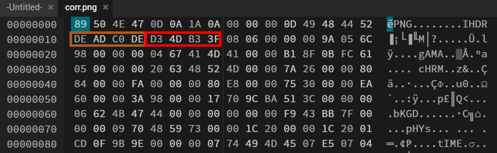
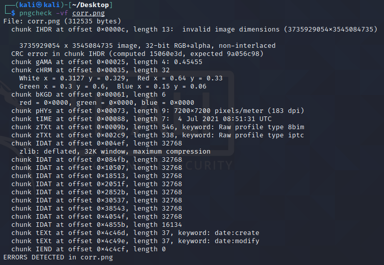

# Challenge Description

Given the description of the challenge:
```
There's a breach in CIA Office this morning. Someone has just 
manipulated the photo of our confidential documents so that
we can't open it. Luckily, the perpetrator didn't change the
image's checksum.

The major told us to recover the image as soon as possible before
he arrives here. Can you recover it back?
```
You can download the challenge from the chall folder.
The objective of the challenge is to recover the corrupted image because of
manipulated IHDR Chunk where the PNG's dimensions are altered.

# POC

The POC can be viewed from `pngcheck` tools and your Hex Editor's preferences.

Hex Editor:


The orange area is the width, and the red one is the height.

Pngcheck Tools:



We know due to altered dimension, the PNG CRC32 Checksum Calculation will produce a false
positive result. You can find the details and PNG Chunk specification from this source:
http://www.libpng.org/pub/png/spec/1.2/PNG-Chunks.html

As we can see we only needs to recalculate the width and height of the image's dimension
precisely according to the CRC32 Checksum Algorithm. This can be done from IHDR Image Header
Chunks.

```
   Width:              4 bytes
   Height:             4 bytes
   Bit depth:          1 byte
   Color type:         1 byte
   Compression method: 1 byte
   Filter method:      1 byte
   Interlace method:   1 byte
 ```
 
 # Solver
 
 Here's the script to solve the problem. We can brute force 4 bytes of the width and height respectively.
 Note that it's in big endian format.
 
 ```python
from binascii import crc32

crc_checksum = int.from_bytes(b'\x9a\x05\x6c\x98',byteorder='big') #\x9a\x05\x6c\x98

for h in range(0xffff):
    for w in range(0xffff):
		    #IHDR Chunk + (4 Bytes Width) + (4 Bytes Height) + Bit Depth + Col Type + Compression Method + Filter Method + Interlace Method
		    crc=b"\x49\x48\x44\x52"+w.to_bytes(4,byteorder='big')+h.to_bytes(4,byteorder='big')+b"\x08\x06\x00\x00\x00"
		    if crc32(crc) % (1<<32) == crc_checksum:
			    print('Image Width: ',end="")
			    print(hex(w))
			    print('Image Height :',end="")
			    print(hex(h))
```

Running the script will output:
```python
Width: 0x33d #Should be \x00\x00\x03\x3d
Height :0x26e #Should be \x00\x00\x02\x6e
```

We can alter the manipulated bytes by the correct bytes in Hex Editor and we'll get the correct picture
which contains the flag.


